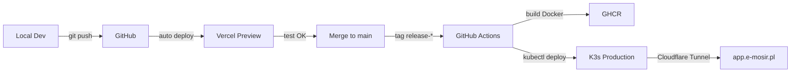

# MOSiR Portal

System zarządzania zadaniami dla Miejskiego Ośrodka Sportu i Rekreacji. Aplikacja webowa z dashboardem, raportami, zarządzaniem użytkownikami i wielodziałową strukturą uprawnień.

## Stack technologiczny

| Warstwa | Technologia |
|---|---|
| Frontend | Next.js 15 (App Router), React, TypeScript, Tailwind CSS, shadcn/ui |
| Backend | Next.js API Routes, Supabase (PostgreSQL, Auth, RLS, Storage) |
| Infrastruktura | K3s (Kubernetes), Cloudflare Tunnel, Tailscale VPN |
| CI/CD | GitHub Actions, Vercel (Auto Preview), K3s (Production) |
| Monitoring | Health endpoint (`/api/health`), Sentry (Error Tracking) |

## Funkcjonalności

- **Dashboard zadań** — tworzenie, przypisywanie, filtrowanie i śledzenie zadań
- **Multi-department** — użytkownicy mogą być przypisani do wielu działów jednocześnie
- **Raporty** — statystyki zadań, wydajność pracowników, analiza działów
- **Zarządzanie użytkownikami** — role (superadmin, dyrektor, kierownik, pracownik), przypisanie do działów
- **Row Level Security** — dane filtrowane na poziomie bazy danych wg roli i działów
- **Powiadomienia** — real-time notifications (Supabase Realtime)
- **Wykres Gantta** — wizualizacja harmonogramu zadań

## Role i uprawnienia

| Rola | Zakres |
|---|---|
| `superadmin` | Pełny dostęp do wszystkich danych i ustawień |
| `dyrektor` | Widok wszystkich działów, zarządzanie zadaniami |
| `kierownik` | Zarządzanie zadaniami w swoich działach (multi-department) |
| `pracownik` | Widok i realizacja zadań w swoich działach |

## Szybki start (development)

Szczegółowy przewodnik: [docs/LOCAL-DEVELOPMENT-GUIDE.md](docs/LOCAL-DEVELOPMENT-GUIDE.md)

```bash
# 1. Sklonuj repozytorium
git clone https://github.com/marmal6313/mosir-portal.git
cd mosir-portal

# 2. Zainstaluj zależności
npm install

# 3. Skopiuj i uzupełnij zmienne środowiskowe
cp .env.example .env.local
# Uzupełnij: NEXT_PUBLIC_SUPABASE_URL, NEXT_PUBLIC_SUPABASE_ANON_KEY, SUPABASE_SERVICE_ROLE_KEY

# 4. Uruchom serwer dev
npm run dev
```

Otwórz [http://localhost:3000](http://localhost:3000)

### Środowiska

| Środowisko | URL | Trigger | Cel |
|---|---|---|---|
| **Local** | http://localhost:3000 | `npm run dev` | Rozwój lokalny |
| **Test (Vercel)** | [mosir-portal.vercel.app](https://mosir-portal.vercel.app) | Push do GitHub | Preview i testowanie |
| **Production (K3s)** | https://app.e-mosir.pl | Tag `release-*` | Produkcja |

## Struktura projektu

```
├── app/                    # Next.js App Router
│   ├── api/                # API routes (users, tasks, health)
│   ├── dashboard/          # Dashboard pages (tasks, reports, users, gantt)
│   └── layout.tsx          # Root layout
├── components/             # React components (UI, charts, notifications)
├── hooks/                  # Custom hooks (useAuth, usePermissions, useUserDepartments)
├── lib/                    # Utilities (supabase client, permissions, keep-alive)
├── types/                  # TypeScript types (database.ts)
├── SQL/                    # Database migrations and verification scripts
├── k8s/                    # Kubernetes manifests (deployment, service, ingress, cloudflared)
├── deploy/                 # Legacy Docker Compose stack (fallback)
├── scripts/                # Deployment scripts
├── docs/                   # Documentation (DEPLOYMENT, RUNBOOK, ADR, plan, worklog)
└── .github/workflows/      # CI/CD pipelines
```

## Deployment

### Workflow: Local → Test (Vercel) → Production (K3s)



### 1. Rozwój lokalny i testowanie

```bash
# Utwórz branch dla nowej funkcji
git checkout -b feature/nazwa-funkcji

# Commituj zmiany
git add .
git commit -m "feat: opis zmian"

# Push do GitHub
git push origin feature/nazwa-funkcji
```

**Rezultat:** Vercel automatycznie tworzy **preview URL** dla tego brancha.

### 2. Testowanie na Vercel

Po push do GitHub:
1. Vercel buduje aplikację
2. Tworzy unikalny URL (np. `mosir-portal-git-feature-nazwa.vercel.app`)
3. Link pojawia się w GitHub PR checks
4. Testuj funkcjonalność na preview URL

### 3. Merge i wdrożenie na produkcję

```bash
# Po zatwierdzeniu PR, merge do main
git checkout main
git pull origin main

# Utwórz release tag
git tag release-$(date +%y%m%d)
git push origin release-$(date +%y%m%d)
```

**Rezultat:** GitHub Actions automatycznie:
- Buduje obraz Docker
- Publikuje do GHCR
- Wdraża na klaster K3s
- Wykonuje smoke test

### Migracje SQL

Migracje uruchamiane ręcznie w Supabase SQL Editor **przed** tagiem release. Pliki w `SQL/`.

### Przewodniki deployment

| Przewodnik | Opis |
|---|---|
| [DEPLOYMENT-FLOW.md](DEPLOYMENT-FLOW.md) | **Pełny przewodnik deployment** (Vercel + K3S) |
| [LOCAL-DEVELOPMENT-GUIDE.md](docs/LOCAL-DEVELOPMENT-GUIDE.md) | Konfiguracja środowiska lokalnego |
| [VERCEL-SETUP-GUIDE.md](docs/VERCEL-SETUP-GUIDE.md) | Konfiguracja Vercel dla testów |
| [GITHUB-SECRETS-SETUP.md](docs/GITHUB-SECRETS-SETUP.md) | Konfiguracja GitHub Secrets dla CI/CD |
| [DEPLOYMENT-ARCHITECTURE.md](docs/DEPLOYMENT-ARCHITECTURE.md) | Architektura deployment na K3s |
| [k8s/README.md](k8s/README.md) | Kubernetes manifests i konfiguracja |

## Dokumentacja

### Dla developerów

| Dokument | Opis |
|---|---|
| [LOCAL-DEVELOPMENT-GUIDE.md](docs/LOCAL-DEVELOPMENT-GUIDE.md) | Konfiguracja środowiska lokalnego (Windows/Mac/Linux) |
| [VERCEL-SETUP-GUIDE.md](docs/VERCEL-SETUP-GUIDE.md) | Konfiguracja środowiska testowego Vercel |
| [GITHUB-SECRETS-SETUP.md](docs/GITHUB-SECRETS-SETUP.md) | Konfiguracja GitHub Secrets dla CI/CD |

### Dla DevOps

| Dokument | Opis |
|---|---|
| [DEPLOYMENT-ARCHITECTURE.md](docs/DEPLOYMENT-ARCHITECTURE.md) | Architektura infrastruktury K3s |
| [k8s/README.md](k8s/README.md) | Kubernetes manifests i deployment |
| [DEPLOYMENT.md](docs/DEPLOYMENT.md) | Pełna dokumentacja wdrożeniowa |
| [RUNBOOK.md](docs/RUNBOOK.md) | Runbook produkcji (diagnostyka, recovery) |

### Inne

| Dokument | Opis |
|---|---|
| [plan.md](docs/plan.md) | Plan rozwoju i release rhythm |
| [worklog.md](docs/worklog.md) | Historia zmian |
| [adr/](docs/adr/) | Architecture Decision Records |
| [SAAS-TRANSFORMATION-COMPLETE.md](docs/SAAS-TRANSFORMATION-COMPLETE.md) | Multi-tenant transformation Phase 1 |
| [PHASE-0-SECURITY-CHECKLIST.md](docs/PHASE-0-SECURITY-CHECKLIST.md) | Kompletny audyt bezpieczeństwa RLS |

## Aktualny release

**`release-250212`** (2026-02-12) — multi-department user assignment, infrastructure fixes.
