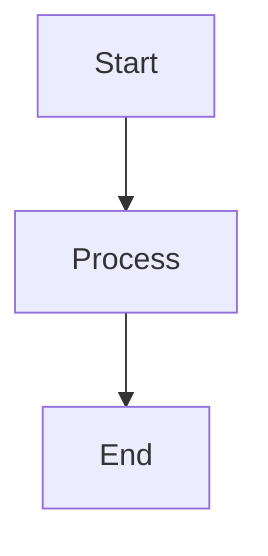
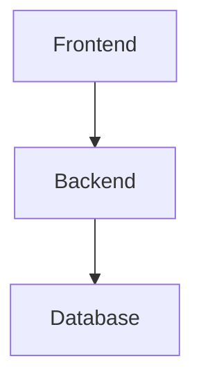
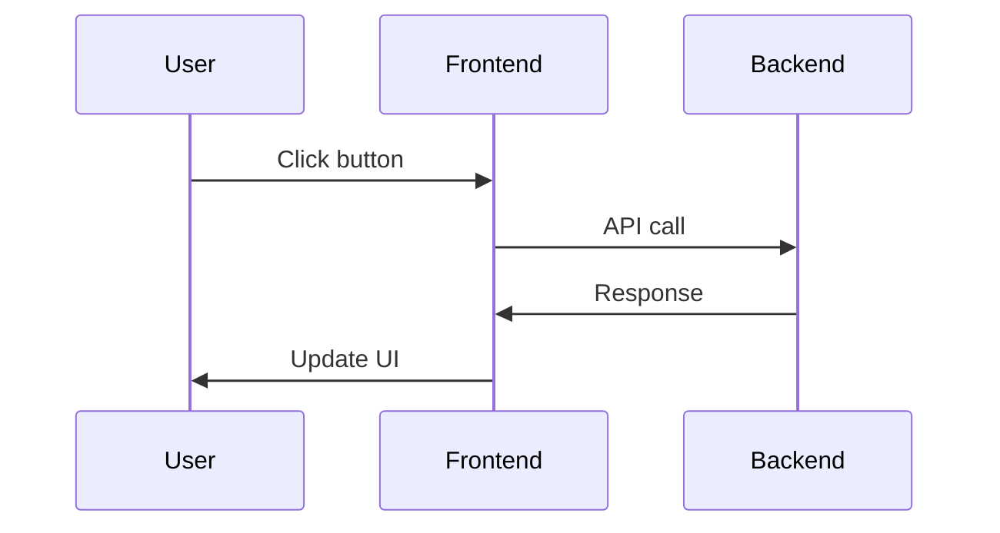

# 📚 Portal Dokumentacji - MOSIR Portal

## 🚀 Szybki start

### Uruchomienie dokumentacji live
```bash
# W root repo
npm run docs:open

# Otwórz http://localhost:3100
```

### Build statyczny
```bash
# Build dokumentacji
npm run docs:build

# Serwowanie zbudowanej wersji
npm run docs:serve

# Otwórz http://localhost:3200
```

## 📁 Struktura

```
docs-portal/
├── docusaurus.config.ts    # Konfiguracja Docusaurus
├── sidebars.ts             # Automatyczne generowanie sidebar
├── src/css/custom.css      # Custom styling
├── static/                 # Statyczne assets
└── package.json            # Zależności Docusaurus

../docs/                    # 📖 Pliki markdown (czytane automatycznie)
├── README.md               # Strona główna
├── instrukcja-systemowa.md # Instrukcja dla dev ops
└── static/                 # Obrazki i pliki statyczne
```

## ⚙️ Konfiguracja

### Porty
- **Development:** 3100 (live preview)
- **Production:** 3200 (built version)

### Funkcje
- ✅ **Mermaid** - diagramy i grafiki
- ✅ **Auto-sidebar** - generuje się z drzewa plików
- ✅ **Markdown** - czytanie z `../docs/`
- ✅ **Responsive** - działa na wszystkich urządzeniach
- ✅ **Search** - wbudowane wyszukiwanie
- ✅ **Dark/Light mode** - automatyczne przełączanie

## 🎨 Customizacja

### Kolory
```css
:root {
  --ifm-color-primary: #2563eb; /* Tailwind blue-600 */
  --ifm-code-font-size: 95%;
}
```

### Mermaid
```markdown

```

### Statyczne pliki
- **Lokalne:** `docs-portal/static/`
- **Współdzielone:** `../docs/static/`

## 🔧 Skrypty

### Root package.json
```json
{
  "scripts": {
    "docs:open": "npm run start --prefix docs-portal",
    "docs:build": "npm run build --prefix docs-portal",
    "docs:serve": "npm run serve --prefix docs-portal"
  }
}
```

### Docusaurus scripts
```json
{
  "scripts": {
    "start": "docusaurus start --port 3100 --host 0.0.0.0",
    "build": "docusaurus build",
    "serve": "docusaurus serve --port 3200 --host 0.0.0.0"
  }
}
```

## 📖 Jak pisać dokumentację

### Struktura plików
```
docs/
├── 01-getting-started.md      # Kolejność w sidebar
├── 02-architecture.md
├── 03-deployment.md
└── static/
    └── img/
        └── diagram.png
```

### Markdown features
- **Nagłówki:** `# ## ###`
- **Kod:** ```typescript ```bash
- **Linki:** `[text](url)`
- **Obrazki:** ``
- **Diagramy:** ```mermaid

### Mermaid examples
```markdown
## Architektura systemu



## Flow aplikacji


```

## 🚀 Deployment

### Vercel
```bash
# Build
npm run docs:build

# Deploy
vercel docs-portal/build
```

### Netlify
```bash
# Build
npm run docs:build

# Deploy
netlify deploy --dir=docs-portal/build
```

### GitHub Pages
```bash
# Build
npm run docs:build

# Deploy
gh-pages -d docs-portal/build
```

## 🔍 Troubleshooting

### Port już zajęty
```bash
# Sprawdź co używa portu
lsof -i :3100

# Zatrzymaj proces
pkill -f docusaurus
```

### Błędy build
```bash
# Wyczyść cache
rm -rf docs-portal/.docusaurus
rm -rf docs-portal/build

# Reinstall dependencies
cd docs-portal && npm install
```

### Problemy z Mermaid
```bash
# Sprawdź wersję
npm list @docusaurus/theme-mermaid

# Update
npm update @docusaurus/theme-mermaid
```

## 📚 Przydatne linki

- [Docusaurus Documentation](https://docusaurus.io/docs)
- [Mermaid Documentation](https://mermaid.js.org/)
- [Markdown Guide](https://www.markdownguide.org/)

## 🤝 Wsparcie

W przypadku problemów:
1. Sprawdź logi w terminalu
2. Przejrzyj [Docusaurus issues](https://github.com/facebook/docusaurus/issues)
3. Skontaktuj się z zespołem deweloperskim

---

**© 2024 MOSIR Portal - Portal Dokumentacji**

