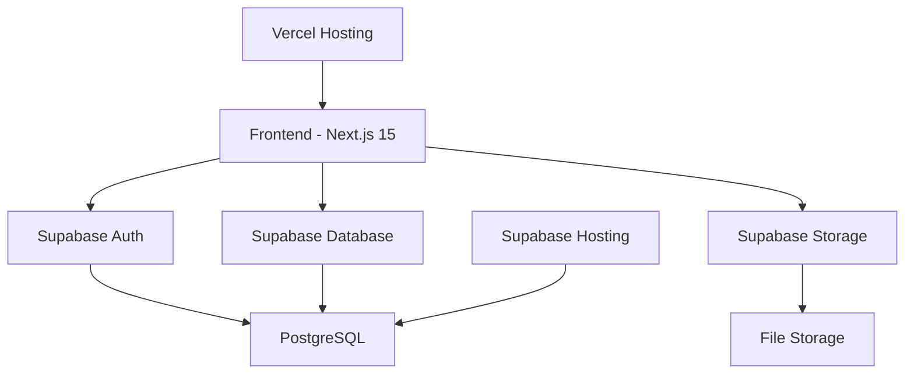
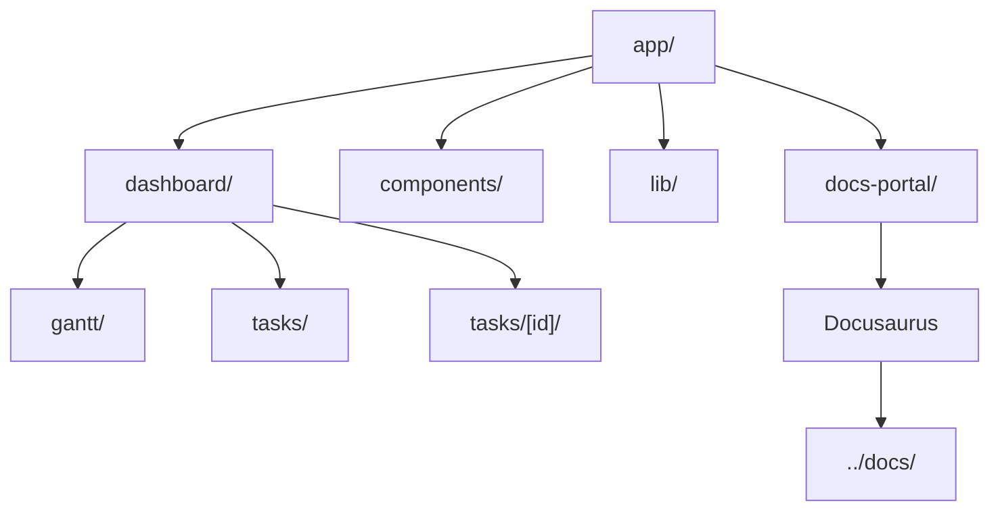

# 📚 Dokumentacja MOSIR Portal

Witaj w dokumentacji projektu MOSIR Portal - systemu zarządzania zadaniami i projektami.

## 🚀 Szybki start

### Wymagania systemowe
- Node.js 18.17+
- npm 9+ lub yarn 1.22+
- RAM: 4GB+
- Disk: 2GB+ wolnego miejsca

### Instalacja
```bash
git clone <repository-url>
cd mosir-portal
npm install
```

### Uruchomienie
```bash
# Development
npm run dev

# Dokumentacja
npm run docs:open
```

## 🏗️ Architektura systemu

### Diagram architektury


### Struktura projektu


## 📊 Funkcjonalności

### Wykres Gantta
- **Wizualizacja czasowa** zadań
- **Drag & drop** dla zmiany dat
- **Filtrowanie** po statusie, priorytecie, departamencie
- **Sortowanie** po różnych kryteriach
- **Wyszukiwanie** w czasie rzeczywistym

### Lista zadań
- **Tabela zadań** z wirtualizacją
- **Zaznaczanie masowe** z checkboxami
- **Filtry zaawansowane** (status, priorytet, departament)
- **Sortowanie** wielokolumnowe
- **URL persistence** - stan zachowany w linku

### Zarządzanie zadaniami
- **Tworzenie** nowych zadań
- **Edycja** istniejących zadań
- **Przypisywanie** do użytkowników
- **Śledzenie** postępu
- **Historia** zmian

## 🎨 Technologie

### Frontend
- **Next.js 15** - React framework
- **React 19** - UI library
- **TypeScript** - type safety
- **Tailwind CSS** - styling
- **Shadcn/ui** - component library

### Backend
- **Supabase** - Backend-as-a-Service
- **PostgreSQL** - database
- **Row Level Security** - bezpieczeństwo
- **Real-time subscriptions** - live updates

### Narzędzia
- **ESLint** - code quality
- **Prettier** - code formatting
- **TypeScript** - type checking
- **React Virtuoso** - virtualization

## 🔧 Konfiguracja

### Zmienne środowiskowe
```bash
# .env.local
NEXT_PUBLIC_SUPABASE_URL=your_supabase_url
NEXT_PUBLIC_SUPABASE_ANON_KEY=your_supabase_anon_key
SUPABASE_SERVICE_ROLE_KEY=your_service_role_key
```

### Dodatkowe przewodniki
- [Konfiguracja zmiany hasła i własnego SMTP](./password-email-setup.md)

### Baza danych
```sql
-- Tabela zadań
CREATE TABLE tasks (
  id UUID PRIMARY KEY DEFAULT gen_random_uuid(),
  title TEXT NOT NULL,
  description TEXT,
  status TEXT DEFAULT 'new',
  priority TEXT DEFAULT 'medium',
  start_date DATE,
  due_date DATE,
  assigned_to UUID REFERENCES auth.users(id),
  department_name TEXT,
  created_at TIMESTAMP WITH TIME ZONE DEFAULT NOW(),
  updated_at TIMESTAMP WITH TIME ZONE DEFAULT NOW()
);
```

## 📱 Responsywność

System jest w pełni responsywny i działa na:
- **Desktop** - pełna funkcjonalność
- **Tablet** - zoptymalizowane menu
- **Mobile** - touch-friendly interface

## 🚀 Deployment

### Vercel (Frontend)
```bash
npm run build
# Automatyczny deployment przez GitHub
```

### Supabase (Backend)
- Automatyczne skalowanie
- Backup codzienny
- Monitoring w czasie rzeczywistym

## 🔍 Monitoring

### Metryki
- **Performance** - Core Web Vitals
- **Errors** - error tracking
- **Usage** - analytics
- **Database** - query performance

### Logi
- **Application logs** - Vercel
- **Database logs** - Supabase
- **Error logs** - error tracking

## 📚 Dodatkowe zasoby

- [Next.js Documentation](https://nextjs.org/docs)
- [Supabase Documentation](https://supabase.com/docs)
- [Tailwind CSS](https://tailwindcss.com/docs)
- [Shadcn/ui](https://ui.shadcn.com/)

## 🤝 Wsparcie

W przypadku problemów:
1. Sprawdź [Issues](https://github.com/your-repo/issues)
2. Przejrzyj dokumentację
3. Skontaktuj się z zespołem deweloperskim

---

**© 2024 MOSIR Portal - All rights reserved**
